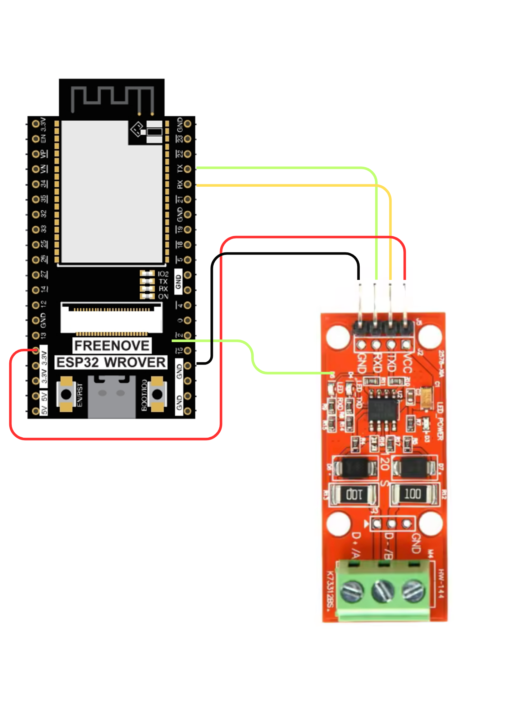
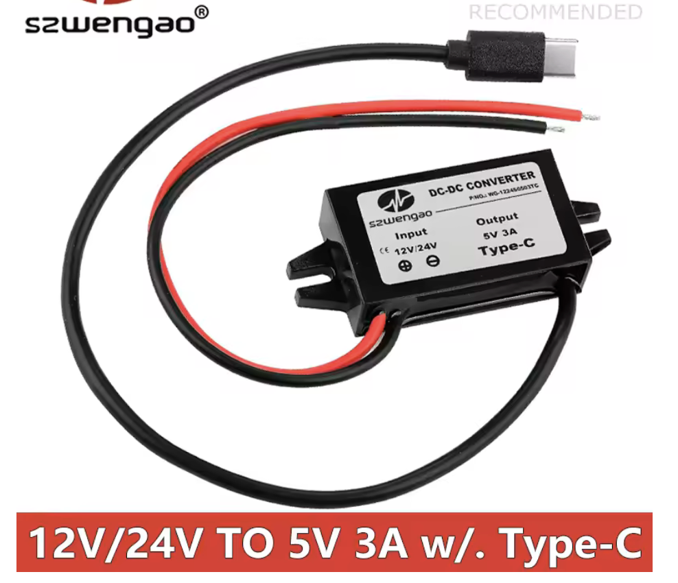

# Tigo RS485 ESP32 Monitor

This project is an enhanced Arduino-based ESP32 sketch to read and log Tigo solar optimizer data (TAP ↔ CCA communication) using RS485.

## 🛠️ Hardware Requirements

- **ESP32 / ESP32-S3** (with enough flash for SPIFFS)
- **TTL to RS485 converter** (e.g., MAX485 or similar)
- **5V regulator** if powered directly from the RS485 bus

## ⚙️ Features

- 🔌 **Reads data from Tigo TAP/CCA RS485 bus**
- 🔍 **Parses frames including power data (0x31) and barcodes (0x09)**.
- 🌐 **Built-in WebServer**:
  - `/` – Live view of all PV modules (with WebSocket)
  - `/debug` – Raw data view (voltage, current, RSSI, etc.)
  - `/spiffs` – File manager (upload/download/delete logs or config)
  - `/logs` – Interactive log viewer (by timestamp)
- 🧠 **Auto barcode detection** via 0x09 frames
- 💾 **Logs to SPIFFS** every 30s (capped to 7 files)
- 🕒 **NTP sync** for accurate timestamps

## 📂 SPIFFS File System

- **nodetable.json** – Keeps module `addr` to `barcode` mapping
- **log_YYYY-MM-DD.json** – Daily logs with all module values
- **index.html** – Optional: Custom UI served on `/`

## 🔄 Automatic NodeTable Save

Once all modules are matched with barcodes (via 0x09 or /debug), the mapping is auto-saved to `nodetable.json`.

## 🧪 Local Debug

Use WebSerial or `/debug` to inspect live parsed values.

## 📡 MQTT

Optionally sends startup message (not real-time data) to a broker.

## 🧾 Log Viewer

The `/logs` interface lets you select a log file and timestamp, and see all module data from that instant.

## 📎 Credits

- Based on the reverse-engineering work by [willglynn/taptap](https://github.com/willglynn/taptap)
- This fork expands it into a full local monitoring platform with logs, real-time view, and persistence.

## Image Config

## 🔓 License

MIT (feel free to adapt for your system)

---
Tnx tictactom for great work (tictactom/tigo_server)
Maintained by the community. Suggestions welcome.
